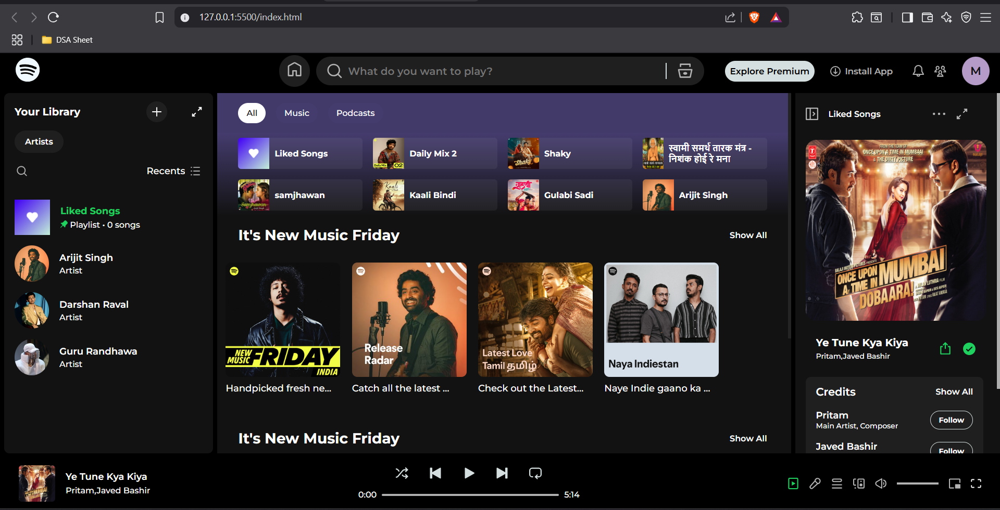

# 🎧 Spotify Web Clone (HTML & CSS)

A fully responsive clone of the Spotify web UI built using only **HTML** and **CSS** — with even better responsiveness than the original!

## 📸 Preview



---

## 🌟 Features

- 🎨 Pixel-perfect UI inspired by Spotify Web
- 📱 Fully responsive across desktop, tablet
- 💡 Built with pure HTML & CSS (no JavaScript)
- 🧱 Flexbox and CSS Grid layout
- 🌈 Modern, clean design

---

## 🛠️ Technologies Used

- HTML5
- CSS3 (Flexbox, Grid, Media Queries)

---

## 📂 Project Structure

spotify-clone/ <br>
├── index.html <br>
├── style.css <br>
├── assets/ <br>
│└── images, icons, etc.<br>
├── README.md<br>
└── screenshot.png<br>

---

## 📥 Installation

To run locally:

1. Clone the repository:

   ```bash
   git clone https://github.com/maheshkokate09/Spotify-Clone.git

   ```

2. Open index.html in your browser.

---

🙋‍♂️ About Me

Made with ❤️ by Mahesh Kokate <br>
🔗 [LinkedIn](www.linkedin.com/in/mahesh-kokate) <br>
📫 Contact: mahesh.g.kokate@gmail.com
